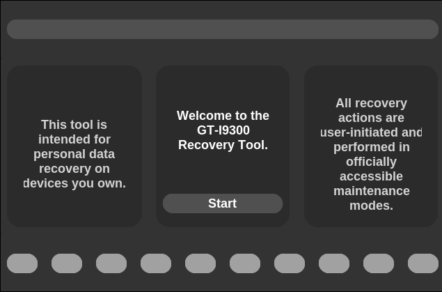
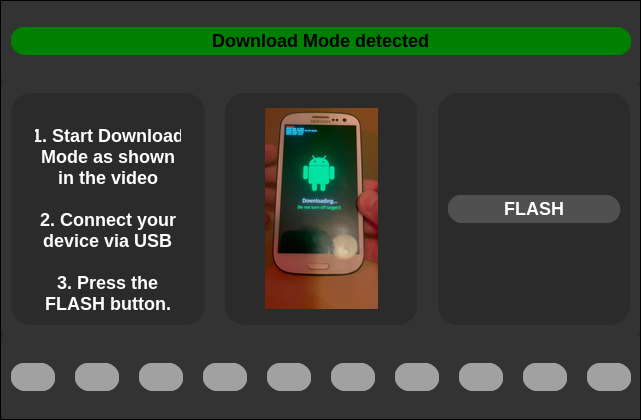
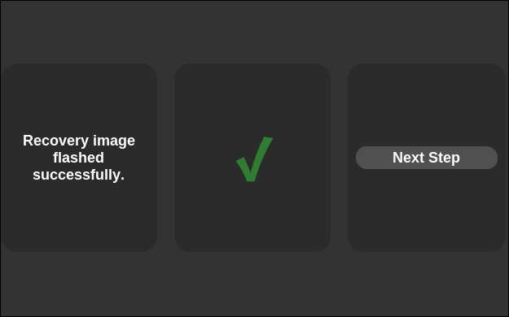
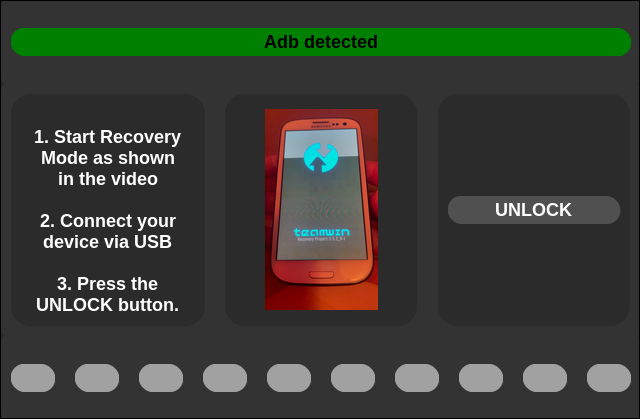
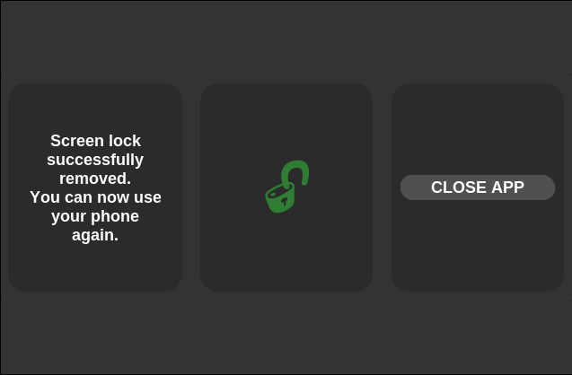

# GT-I9300 Recovery Application

## About

This tool  is a state-driven desktop application built with **Tkinter** and **CustomTkinter** for guided recovery operations on Samsung GT-I9300 devices.

The tool provides a structured workflow to:

- Detect **Download Mode** via Heimdall
- Flash a custom recovery image (TWRP)
- Detect device connection via ADB
- Remove Android screen lock files
- Guide the user visually through each step

All actions are user-initiated and executed through officially accessible maintenance interfaces (Download Mode / Recovery Mode).

---

## Purpose

This application is designed for **personal data recovery on devices you own**.

It simplifies low-level command-line flashing and unlocking operations by:

- Monitoring device state in background threads
- Executing system commands safely
- Providing visual progress feedback
- Preventing invalid user actions through state control

---

## Demo ➔ https://youtu.be/tJ3gSMfpASM

## Core Architecture

### 1. State Machine

The application is controlled through `AppState`:

- `INTRO`
- `FLASH_PREP`
- `FLASH_DONE`
- `UNLOCK_PREP`
- `UNLOCK_DONE`

Each state:
- Configures UI elements
- Starts or stops workers
- Enables/disables actions
- Defines the next transition

State transitions are handled via:

```python
changeState()
renderState()
```

### 2. Concurrency Model

The application separates UI and background tasks using dedicated worker threads.

Communication pattern:

Worker Thread → queue.Queue → poll_queue() → UI update (main thread)

Worker threads communicate via `queue.Queue`, and all UI mutations are scheduled on the Tkinter main loop using `root.after()`.

### 3. Worker Components

- MonitorWorker  
  Continuously checks device state (Download Mode / ADB).

- CmdWorker  
  Executes system commands (heimdall, adb).

- Loading_Worker  
  Controls progress animation.

- VideoPlayer  
  Streams instructional video frames into the UI.

### 4. Event Management

Thread coordination is handled through EventController,
which encapsulates threading.Event objects for:

- stopping USB monitoring
- stopping video playback
- controlling loading state

### 5. UI-State Separation

UI rendering logic is separated from state transitions.

- changeState() triggers logical transition
- renderState() defines UI composition

## Screenshots

<h3 align="center">INTRO</h3>
<p align="center">
  
</p>

<h3 align="center">FLASH_PREP</h3>
<p align="center">
  
</p>

<h3 align="center">FLASH_DONE</h3>
<p align="center">
  
</p>

<h3 align="center">UNLOCK_PREP</h3>
<p align="center">
  
</p>

<h3 align="center">UNLOCK_DONE</h3>
<p align="center">
  
</p>

